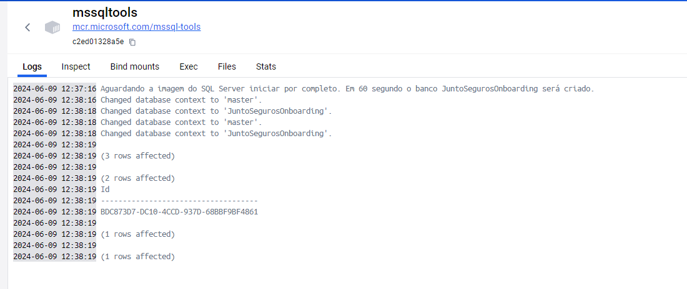
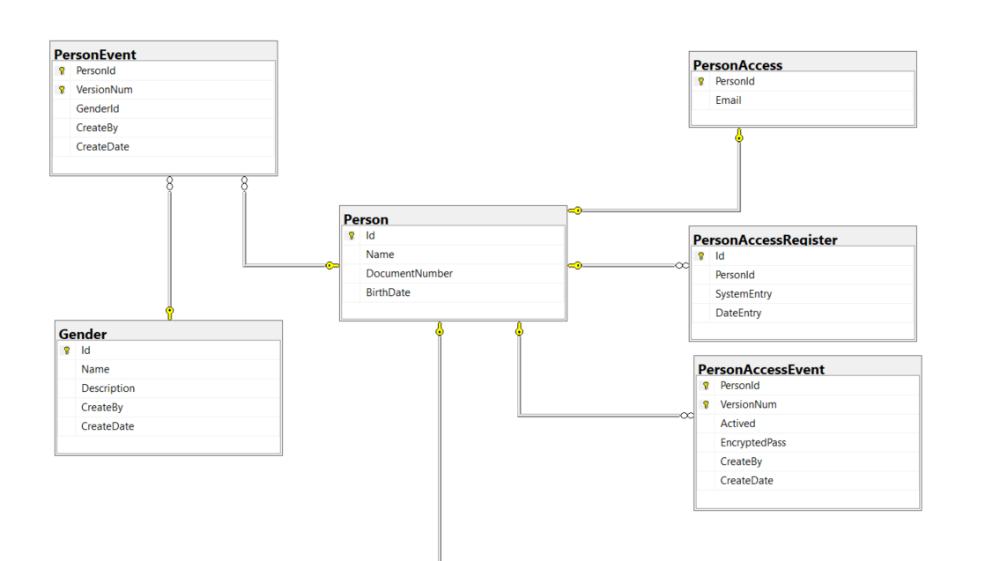
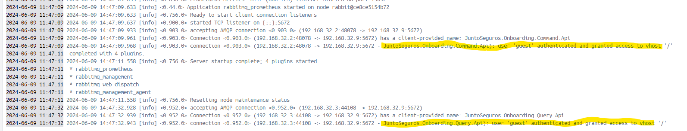

# JuntoSeguros
# Intenção

Este projeto é uma aplicação de teste com a finalidade de criar um CRUD de pessoa e acesso deste.

## DDD

Foi concebido sob a abordagem do que prega o **Domain-Driven Design (DDD)**. Houve duas complexidades: técnica e de negócio. **Pessoa(Person)** como domínio principal e **Acesso** (ou **PersonAccess**) como domínio auxiliar.

## Arquitetura
Eu concebi este projeto com foco em escalabilidade, performance e segurança, alinhado às normativas do BACEN. Optei por uma arquitetura baseada em micro serviços, aplicando os conceitos de **Event-Driven** e **Event-Source**. Ao observar as tabelas do banco, será notado que para toda alteração há um evento aplicado a este, e cada mudança recebe uma nova versão, nesse ponto seguimos o conceito de **Event-Source**. Eventos são disparados a cada alteração a quem interessar e nesse ponto é observado a aplicação de **Event-Driven**. Para otimizar a performance, especialmente considerando a complexidade do banco de dados, adotei o padrão **CQRS (Command Query Responsibility Segregation)**. Esse padrão consiste em separar as operações de leitura (queries) das operações de escrita (commands). Por meio do CQRS, desenvolvi APIs distintas: uma para consulta com o nome de **JuntoSeguros.Onboarding.Query.Api** e outra para alteração com o nome **JuntoSeguros.Onboarding.Command.Api**. Seguindo essa arquitetura, minha intenção foi minimizar a concorrência entre leitura e escrita na mesma base. Os componentes utilados para antenderem a demanda desses padrões, são:

## Banco de Dados
* Sql Server
   - user:sa
   - senha:SqlServer2022!
* MongoDB
* ElasticSearch

## Mensageria
* RabbitMQ
    * user:guest
    * senha:guest
    * http://localhost:15672/#/

## Observabilidade
A observabilidade em aplicações refere-se à capacidade de compreender e monitorar efetivamente o comportamento interno e o desempenho de um sistema em tempo real. Para tal adaptei o código para atender a esses conceitos e utilizei de algumas ferramentas, sendo:
* Kibana
    * Visualização dos logs
    * http://localhost:5601/app/home#/
* Jaeger
    * Telemetria
    * http://localhost:16686/

## Premissas
Seguindo os princípios do bom desenvolvimento de software, construí este projeto com ênfase na arquitetura da solução e da aplicação. A análise do código revela uma separação em camadas bem definida, onde a camada de domínio, responsável pelas regras de negócio, é acessada exclusivamente por meio de interfaces bem definidas, chamadas de portas e o componente que apoia a lógica de negócio se adapta a essas portas. Essa abordagem, conhecida como **arquitetura hexagonal**, promove a independência da lógica de negócio em relação às tecnologias e frameworks utilizados, facilitando testes, manutenabilidade e reuso de código. O projeto também incorpora os princípios SOLID, um conjunto de boas práticas que garantem a coesão e baixo acoplamento. Essa combinação resulta em um código mais robusto, flexível e fácil de entender. 
Para garantir a qualidade do código segui conceitos do Clen Code e realizei testes unitários com alta cobertura, verificando o funcionamento individual de cada componente. Além disso, um teste de integração foi realizado para validar a interação entre os repositórios e as operações com o banco de dados.

## Considerações
Para apresentar esse projeto, tive pouco tempo e, por isso, não organizei algumas coisas que considero necessárias. Por exemplo, cada serviço deveria estar em uma solution separada. Além disso, as partes comuns deveriam estar em um gerenciador de pacotes interno da empresa. Nesse caso, seria interessante subir uma imagem do NuGet no Docker para essa finalidade. Infelizmente, do meu ponto de vista, a organização não atingiu um nível satisfatório.  
Outro ponto importante é que não foi adicionada resiliência de negócio. Isso significa que, se ocorrer um erro, não há regras de retentativa. Como a intenção é atualizar uma base NoSQL, na ocorrência de um erro, os dados atualizados não estarão disponíveis nas consultas das query APIs. Fica o lembrete para futuras análises.  
Na command api, exemplifiquei algumas rotas. As de PersonAccess, PUT, acabam executado a mesma coisa, mesmo com nomes diferentes. Na command faltou exemplo com o verbo PATCH. Contudo minha intenção foi mostrar a aplicação de conceitos arquiteturais e qualidade de escrita de código, a forma de escolha de como expor isso ao mundo, qual tipo de apresentação e o que apresentar é algo viável dentro desse projeto, mas que por questões de tempo, não foram implementadas.
#### Nesse projeto, por conta do tempo, não foram adicionado:
* Desenvolvimento de Benchmark testes para emular testes de carga.
* Integração com Grafana para obteção de métricas e contrução de alertas e notificações.
* Worker em .net core para funcionar como consumer e empacotamento de evento para auto descritivos.
* BFF em NodeJs que validaria a autenticação do usuário para realizar a orquestração da Command e Query API.
* API Service para fonercer serviços de altenticação de usuário. Esse serviço iria fazer uso do Redis para controle de cache distribuído.

## Conteinerização
A aplicação foi projetada com orquestração de containers em mente, facilitando a implantação e o gerenciamento em ambientes escaláveis. A viabilidade de orquestração foi validada por meio de testes com o Docker Compose, demonstrando potencial para utilização em produção com ferramentas como o Kubernetes.

## Inicialização do Projeto
Na raiz do projeto, assim que feito o pull request, abra o terminal e execute o comando abaixo.  
Em toda reinicialização do docker, sempre e antes de nova inicialização **exclua o diretório DockerAppFiles** criado na raiz do projeto.  
No POST de PersonAccess o campo Email é validado.
No POST de Person o campo Document é o CPF, esse campo é validado.  
```bash
docker-compose up -d
```

Depois de subir o container é necessário validar alguns logs, sendo:
* Para garantir que o SqlServer esteja iniciado e com o banco de dados **JuntoSegurosOnboarding**, verifique no container **mssqltools** os seguintes logs:


* Acessando o banco de dados via Manangement Studio teremos as seguintes relações de tabelas:

Caso o banco não existe, há duas formas de criar, ou iniciando o container **mssqltools** novamente, até que ele termine o processo, ou abrir o diretório *Docker\MSTools\init\\* e executar no Management Studio as queries e na ordem que aqui aparecem, sendo:
    * JuntoSegurosOnboarding_Creation.sql
    * JuntoSegurosOnboarding_Insertions.sql

* É necessario que o RabbitMQ estaja iniciado e plugado as aplicações, para isso devermos verificar no container **rabbitmq** os seguintes logs:


## Acesso
Por fim, acesso o swagger das aplicações, nos endereços:
* http://localhost:32804/swagger/index.html
   * JuntoSeguros.Onboarding.Command.Api
* http://localhost:32805/swagger/index.html
   * JuntoSeguros.Onboarding.Query.Api

